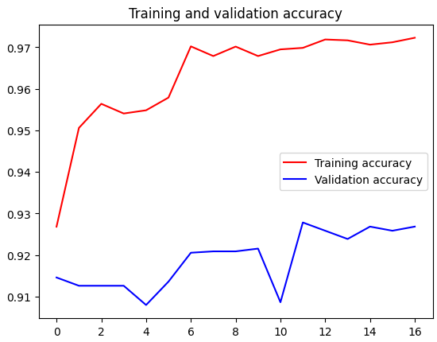

# DentifyCare-ML  
*Dental Disease Classification with Pretrained InceptionV3 Model*  

DentifyCare-ML utilizes transfer learning with the InceptionV3 model to classify dental diseases into six categories. This README outlines the dataset, model, tools, training process, and results of the project.  

---

## Dataset  
The dataset used for training and evaluation can be downloaded here:  
[*Dental Disease Dataset*](https://drive.google.com/drive/folders/139hFbLExoB3QEQeYFJRJw_zQt9yjXLE1?usp=sharing)  

 
## Categories of Dental Diseases:  
1. *Mouth Ulcer*  
   - *Description*: Sores that appear in the mouth, often causing pain and discomfort.  
   - *Symptoms*: Painful sores, redness, swelling, difficulty eating or speaking.  
   - *Causes*: Stress, injury to the mouth, infections, certain foods, or hormonal changes.  

2. *Hypodontia*  
   - *Description*: A condition where one or more teeth are missing, affecting the dental development.  
   - *Symptoms*: Missing teeth, issues with tooth alignment.  
   - *Causes*: Genetic factors, developmental anomalies, or environmental factors.  

3. *Calculus*  
   - *Description*: Hardened plaque on teeth, also known as tartar, that can cause gum disease.  
   - *Symptoms*: Yellow or brown deposits on teeth, bad breath, swollen gums.  
   - *Causes*: Poor oral hygiene, lack of regular brushing and flossing, smoking.  

4. *Gingivitis*  
   - *Description*: Inflammation of the gums, often caused by bacterial infection.  
   - *Symptoms*: Red, swollen gums that may bleed when brushing or flossing.  
   - *Causes*: Poor oral hygiene, plaque buildup, smoking, certain medications.  

5. *Caries*  
   - *Description*: Tooth decay caused by bacterial activity on the enamel, leading to cavities.  
   - *Symptoms*: Tooth sensitivity, visible holes or pits in teeth, toothache.  
   - *Causes*: Poor oral hygiene, high sugar intake, insufficient fluoride.  

6. *Tooth Discoloration*  
   - *Description*: Staining or darkening of teeth, affecting their natural color.  
   - *Symptoms*: Uneven tooth color, stains, or spots.  
   - *Causes*: Coffee, tea, tobacco, certain medications, and poor oral hygiene.  


---

## Dataset Structure  
- *Train*: Labeled images for training.  
- *Validation*: Images for model validation during training.  
- *Test*: Images for evaluating model performance.  

---

## Model Architecture 


The project employs *InceptionV3* (pretrained on ImageNet) with the following modifications:  
- *Flattening Layer*: Converts output into a 1D vector.  
- *Dense Layers*: Added layers with ReLU activation.  
- *Dropout Layers*: Prevent overfitting.  
- *Softmax Layer*: Outputs probabilities for the six categories.  

### Fine-Tuning:  
1. Train the top layers of the model first.  
2. Unfreeze some base model layers and fine-tune the entire model.


---

## Tools and Libraries  
- *TensorFlow*: Model building, image preprocessing, and training.  
- *NumPy*: Numerical operations and array handling.  
- *Matplotlib*: Visualizing training accuracy and loss.  
- *Google Colab*: Development environment with GPU support.   

---

## Training Procedure  
### Dataset Preparation  
- Resize images to (224, 224).  
- Augmentation: RandomFlip, RandomRotation, and RandomZoom.  

### Model Training  
- *Optimizer*: Adam with learning rate scheduling.  
- *Loss Function*: sparse_categorical_crossentropy.  
- *Callbacks*:  
  - Early stopping for improved efficiency.  
  - Learning rate scheduler for better convergence.  

---

## Results  
- *Training Accuracy*: ~96.9%  
- *Validation Accuracy*: ~92.78%  
- *Test Accuracy*: ~92.70%  

### Accuracy and Loss Graph  
  

---

## Setup and Usage  

### Installation  
1. Clone the repository:    
    ```bash
    git clone https://github.com/Dentifycare/DentifyCare-ML.git
    cd DentifyCare-ML
   

2. Install dependencies:
   ```bash
    pip install tensorflow matplotlib numpy

### Running the Code
1. Preprocess the Dataset
    ```bash
    from tensorflow.keras.utils import image_dataset_from_directory
    training_dataset = image_dataset_from_directory(
    "path_to_training_data",
    image_size=(224, 224),
    batch_size=32,
    label_mode="int"
    )

2. Train the Model
    ```bash
    history = model.fit(
    training_dataset,
    validation_data=validation_dataset,
    epochs=50,
    callbacks=[early_stopping, lr_scheduler]
    )

3. Evaluate the Model
    ```bash
    test_loss, test_accuracy = model.evaluate(test_dataset)
    print(f"Test Accuracy: {test_accuracy * 100:.2f}%")

4. Save the Model
    ```bash
    model.save('model_dentifycare.keras')

---
## Pretrained Model
Download the pretrained model: (https://drive.google.com/file/d/1-39RTzx1TgT9jJWFaKJOUL6rpVQWg8dD/view?usp=drive_link)
